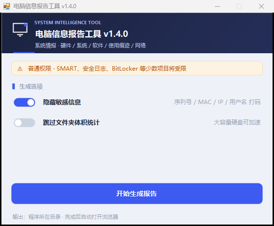

# 电脑信息报告工具（SysInfoTool）v1.5.0

一个绿色单文件小工具：采集电脑的硬件、系统、软件、使用痕迹与网络信息，生成**两份交付产物**：
- `*.html` —— **面向人阅读的界面**：按《澄明情报报告》设计语言渲染
- `*.json` —— **面向程序/AI 解析**：结构化规范 v1.1，具名字段 + 分组排序 + 美化缩进

<p align="center">
  
</p>

## 快速开始

1. 把 `SysInfoTool.exe` 拷到目标机器任意目录（U盘也可以，无需安装）；
2. **建议右键 → 以管理员身份运行**（普通权限也能跑，但 SMART 状态、安全日志、BitLocker 等少数项目会受限）；
3. 点击「开始生成报告」，等待 5–30 秒；
4. 报告生成后自动在浏览器打开，文件保存在 `exe所在目录/<电脑名>/` 下。

## 界面选项

| 选项 | 默认 | 说明 |
|---|---|---|
| 隐藏敏感信息 | ✅ 开启 | 打码序列号、MAC、IP 后两段、用户名、SSID、计算机名 |
| 跳过文件夹体积统计 | 关闭 | 大容量硬盘可勾选以加速 |

## 命令行模式

```
SysInfoTool.exe --console              # 无界面直接生成
SysInfoTool.exe --console --no-mask    # 关闭脱敏
SysInfoTool.exe --console --skip-scan --out=D:\报告
```

### 输出结构

```
<输出目录>/<电脑名>/<电脑名>_日期时间.html
<输出目录>/<电脑名>/<电脑名>_日期时间.json
```

无法获取电脑名时，归入 `未知` 文件夹。

## 采集内容（26 个模块）

| 分类 | 模块 |
|------|------|
| **硬件** | CPU、主板/BIOS/TPM、内存（每根独立展示）、硬盘（HDD/SSD/NVMe/健康状态/BitLocker）、显卡、显示器（EDID）、网卡（含 WiFi 代数）、声卡、电池健康度、USB 控制器与设备 |
| **系统** | 版本/Build/激活渠道、安装日期、更新历史与挂起重启、UEFI/安全启动/快速启动、页面文件、还原点/卷影副本、环境变量 |
| **软件** | 已安装程序、启动项、服务、计划任务、驱动（含问题设备）、浏览器及书签/扩展、.NET/VC++/DirectX/Java/Python/Node、字体 |
| **痕迹** | 用户目录体积、最近打开文件、回收站、临时文件、RunMRU、地址栏历史、WiFi 配置、打印机、蓝牙配对、共享文件夹 |
| **性能与日志** | Uptime、内存快照、Top 进程、WinSAT 评分、事件日志（12 类排查信息）、蓝屏记录、登录失败统计 |
| **网络** | IP/网关/DNS/MAC、代理、监听端口与进程、网络配置 |

### 事件日志（面向错误排查）

| 采集项 | 说明 |
|--------|------|
| 系统/应用/安装日志 | 近 30 天 Critical/Error/Warning 统计 + 最多 20 条严重事件明细 |
| 蓝屏记录（BugCheck 1001） | 最多 30 条，含错误代码与描述 |
| 意外关机/重启（Kernel-Power 41） | 排查自动重启必看 |
| 计划内关机/重启（User32 1074） | 排查"谁关的机" |
| WHEA 硬件错误 | CPU/内存/主板硬件故障排查 |
| 磁盘错误（Event 7/11/15/51/55） | 硬盘问题排查 |
| 服务异常崩溃（7031/7034） | 反复崩溃的服务统计 |
| 驱动加载失败（PnP 219） | 驱动兼容问题 |
| Minidump 文件列表 | 含文件名、大小、时间 |
| 登录失败统计（Security 4625） | 近 30 天次数 + 最多 15 条记录 |

## 总览看板卡片

按固定顺序排列，每张卡片标注状态徽章：

| 顺序 | 卡片 | 状态 |
|------|------|------|
| 1 | 🪟 系统 | 正常/失败 |
| 2 | 🧠 CPU | 正常/失败 |
| 3 | 🧱 内存 | 正常/失败（混插时标注标称频率） |
| 4 | 🎮 显卡 | 正常/失败 |
| 5 | 💽 硬盘 | 正常/需关注/异常 |
| 6 | 🔋 电池 | 正常/有损耗/损耗严重 |

## 按设计不采集

温度/风扇传感器、SMART 详细属性、硬盘测速、内存颗粒 SPD、CPU 睿频/TDP、显卡核心代号、显示器面板类型、USB 协商速率、浏览器历史/下载记录、WiFi 密码/连接时长。报告中均有说明。

## 更新日志

详见 [CHANGELOG.md](CHANGELOG.md)

## 本地构建

无需安装 .NET SDK，直接使用 Windows 自带的 .NET Framework 编译器：

```powershell
.\build.ps1                # 输出到仓库根目录 SysInfoTool.exe
.\build.ps1 -OutDir .\bin  # 输出到指定目录
```

构建脚本会自动备份旧版本为 `SysInfoTool_v版本号_backup.exe`。

也可用任意支持 SDK 风格项目的 .NET SDK 打开 `Source\SysInfoTool.csproj` 构建。

## 环境要求

- Windows 10 1809+ / Windows 11（x64）
- 无需安装 .NET（系统自带 4.8）
- 单文件约 220KB，零外部依赖，不联网

## 项目结构

```
Source/
├── Collectors/          # 26 个信息采集器
├── Core/                # 核心架构（采集器接口、调度器、报告模型、总控）
├── Gui/                 # WinForms GUI（主界面、自定义控件、主题）
├── Helpers/             # 工具类（WMI、注册表、进程、脱敏、JSON 等）
├── Output/              # 输出层（HTML 报告、JSON 报告）
├── Program.cs           # 入口
└── SysInfoTool.csproj   # 项目文件
```

## 已知说明

- 杀软可能提示：本工具读取浏览器书签与 USB 历史属取证类行为，属正常现象，加白即可
- 报告末尾会列出「采集失败项」及原因，以管理员身份重跑通常可解决
- 安全日志（登录成功/失败审计）需要管理员权限

## License

MIT
